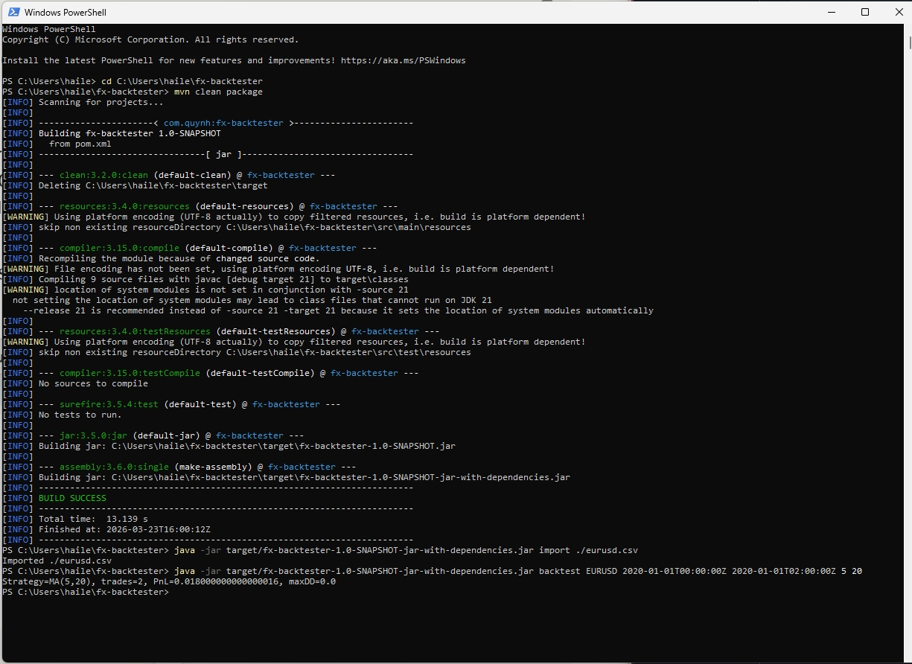

# FX Backtester



A lightweight Java CLI application for backtesting FX spot trading strategies on historical price data.

## Overview

This tool ingests FX spot prices from CSV into a local embedded H2 database, supports time-windowed querying, and runs configurable MA crossover backtests with PnL and drawdown reporting.

## Strategy

The strategy backtested is a **Moving Average (MA) Crossover**:

- Define two moving averages: a fast MA (short window) and a slow MA (long window)
- When the fast MA crosses above the slow MA &rarr; **buy** (go long)
- When the fast MA crosses below the slow MA &rarr; **exit** (close position)
- PnL : 0.018 means the EURUSD spot price moved 0.018 in our favour across the 2 trades — that's 18 pips (not 180).
 

## Tech Stack

- Java 21
- Maven
- H2 (embedded database, JDBC)
- OpenCSV

## Project Structure

```
fx-backtester/
├── pom.xml
└── src/main/java/com/quynh/fxapp/
    ├── App.java                    # CLI entry point
    ├── db/
    │   ├── DatabaseManager.java    # JDBC connection & schema init
    │   └── FxPriceDao.java         # Batch insert & time-windowed queries
    ├── model/
    │   └── FxPrice.java            # FX spot price domain object
    ├── strategy/
    │   ├── Strategy.java           # Strategy interface
    │   ├── MaCrossoverStrategy.java # MA crossover implementation
    │   └── BacktestResult.java     # PnL, trades & drawdown container
    └── service/
        ├── ImportService.java      # CSV ingest into H2
        └── BacktestEngine.java     # Loads data & runs strategy
```

## Getting Started

### Prerequisites

- JDK 21
- Maven

### Build

```bash
mvn clean package
```

### Import CSV data

```bash
java -jar target/fx-backtester-1.0-SNAPSHOT-jar-with-dependencies.jar import ./eurusd.csv
```

CSV format:
```csv
ts,ccy_pair,spot
2020-01-01T00:00:00Z,EURUSD,1.1205
2020-01-01T00:01:00Z,EURUSD,1.1207
```

### Run backtest

```
java -jar target/fx-backtester-1.0-SNAPSHOT-jar-with-dependencies.jar backtest <ccyPair> <from> <to> <fastMA> <slowMA>
```

| Parameter | Description | Example |
|-----------|-------------|---------|
| `ccyPair` | Currency pair (must match imported data) | `EURUSD` |
| `from` | Start timestamp (ISO 8601) | `2020-01-01T00:00:00Z` |
| `to` | End timestamp (ISO 8601) | `2020-02-01T00:00:00Z` |
| `fastMA` | Fast moving average window | `5` |
| `slowMA` | Slow moving average window | `20` |

### Example runs

**Short intraday window (2 hours, 1-min bars):**
```bash
java -jar target/fx-backtester-1.0-SNAPSHOT-jar-with-dependencies.jar backtest EURUSD 2020-01-01T00:00:00Z 2020-01-01T02:00:00Z 5 20
# Strategy=MA(5,20), trades=2, PnL=0.0180, maxDD=0.0
```

**Full month:**
```bash
java -jar target/fx-backtester-1.0-SNAPSHOT-jar-with-dependencies.jar backtest EURUSD 2020-01-01T00:00:00Z 2020-02-01T00:00:00Z 10 50
```

**Full year:**
```bash
java -jar target/fx-backtester-1.0-SNAPSHOT-jar-with-dependencies.jar backtest EURUSD 2020-01-01T00:00:00Z 2021-01-01T00:00:00Z 10 50
```

## Architecture

- **db/** &mdash; JDBC database manager and DAO for batch inserts and time-windowed queries
- **model/** &mdash; FxPrice domain object
- **strategy/** &mdash; Strategy interface and MA crossover implementation with PnL/drawdown tracking
- **service/** &mdash; Import service (CSV ingest) and backtest engine

### Why H2?

H2 is an embedded database engine that runs inside the Java process &mdash; no separate server to install.

- **Local** &mdash; the database lives as a file (`fxdb.mv.db`) on your machine
- **Zero setup** &mdash; no installing MySQL, no creating users, no starting services
- **Portable** &mdash; the whole database is a single file you can copy or delete
- **Swappable** &mdash; uses standard JDBC/SQL, so you can switch to Postgres or MySQL by changing the connection URL in `DatabaseManager.java`

## Roadmap

- [ ] Additional strategies (mean reversion, Bollinger Bands, RSI)
- [ ] JavaFX GUI
- [ ] Multi-pair and cross-pair support
- [ ] Sharpe ratio, Sortino ratio, and additional risk metrics
- [ ] Live data feed integration
- [ ] Swap to Postgres/MySQL for production use
